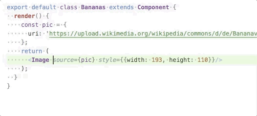
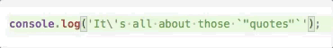

# IntelliChange

This extension is triggered by code edits and applies additional changes when default behavior of VS Code can be improved.

## Features

* Extra whitespace removal after `Enter`

When editing single long line into multiple lines, often you have to
deal with pesky whitespace, e.g. between function parameters. This
feature eliminates the need to think about it, just press `Enter`.

* Replace quote and matching quote instead of surrounding with new quotes

After user selects a quote in editor and presses a key for new quote
VS Code by default surrounds the old quote with new quotes. This feature
makes it instead replace old quote with the new quote and also finds
matching quote and replaces it too (fixing any quote escaping along the
way.)

## Installation

  1. > git clone git@github.com:wix-playground/intellichange.git
  2. > cd intellichange
  3. > npm install
  4. > npm install -g vsce
  5. > vsce package

Or, if you are from Wix, [download](https://drive.google.com/open?id=1GC87wIarHmMfFUv52BfYeyeB0N0SCptf) extension file instead of steps 1.-5.

  6. > code --install-extension intellichange-0.0.4.vsix

If `code` is not in your path, fix it [for MacOS](https://code.visualstudio.com/docs/setup/mac#_launching-from-the-command-line) inside Code
or reinstall [for Windows](https://code.visualstudio.com/docs/setup/windows)
